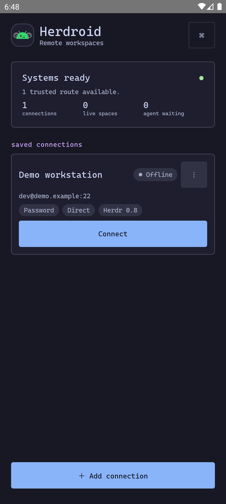
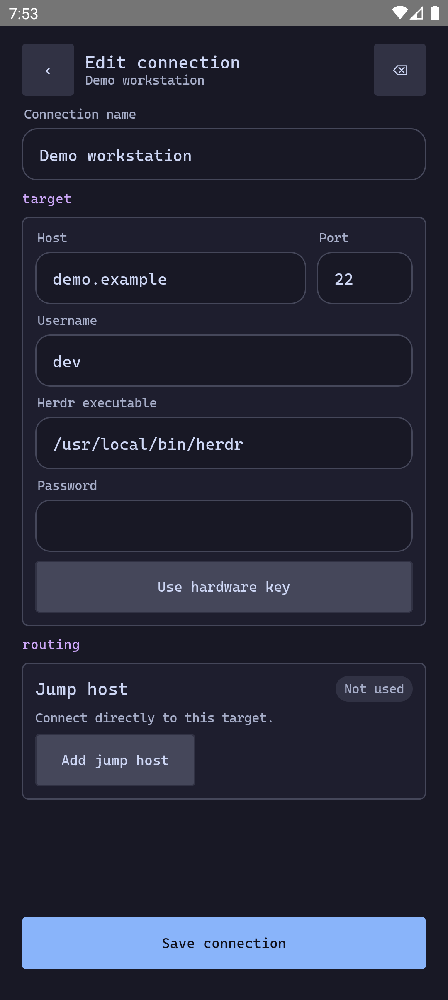
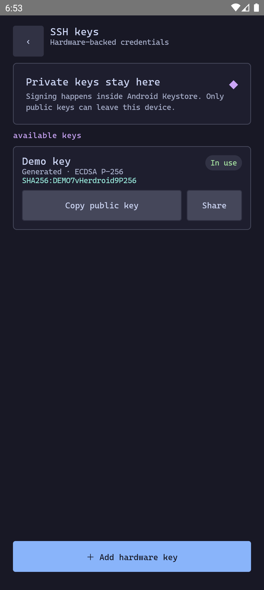
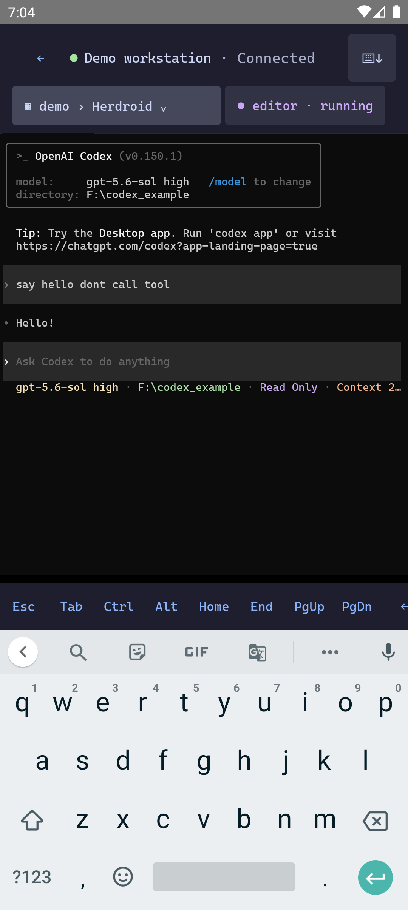
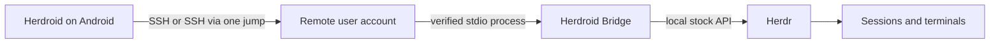

<p align="center"></p>

<h1 align="center">Herdroid</h1>

<p align="center">
  A native Android™ client for your Herdr sessions.<br>
  Secure SSH connections, live workspace state, and a real remote terminal.
</p>

<p align="center">
  <a href="https://github.com/deex2/herdroid/actions/workflows/ci.yml"></a>
  
  
  <a href="LICENSE"></a>
</p>

| Connections | Editor | SSH keys | Terminal |
|:---:|:---:|:---:|:---:|
|  |  |  |  |

Herdroid brings the Herdr desktop workflow to a phone-sized interface. Save
direct or jump-host routes, connect with a password or hardware-backed SSH key,
browse the live session/workspace/tab/pane hierarchy, and open the stock Herdr
terminal from anywhere your SSH server is reachable.

> [!WARNING]
> Herdroid is in active development. GitHub Releases contains signed prerelease
> APKs; ordinary CI artifacts remain unsigned development builds.

## Highlights

| | |
|---|---|
| **SSH-native** | Direct and single-jump routes to Linux and Windows hosts, with independent credentials for each hop. |
| **Hardware-backed keys** | Generate or import ECDSA P-256 keys into Android Keystore. Private keys are never exportable from Herdroid. |
| **Host verification** | New and changed SSH host keys require an explicit fingerprint decision. |
| **Trusted bridge** | Installs the small per-user bridge only after approval, verifies its SHA-256, and starts no daemon or network listener. |
| **Fast reconnects** | Reuses a previously verified bridge path while retaining the full discovery and repair fallback. |
| **Live hierarchy** | Follow Herdr sessions, workspaces, tabs, panes, and coding-agent state from a touch-first interface. |
| **Agent alerts** | Detects coding-agent state changes and notifies you when an agent is waiting or finished; tap to open its exact terminal pane. |
| **Remote terminal** | Full terminal rendering, keyboard helpers, scrolling, resize, selection, and explicit takeover. |
| **Encrypted local state** | Saved routes, known hosts, and key metadata stay in encrypted app storage. |

## How it works



The bridge is installed below
`~/.herdroid/plugins/dev.herdroid.bridge/<version>/<target>` and communicates
only through the authenticated SSH process standard input/output. Herdroid does
not patch Herdr, expose a remote service, or require elevated privileges.

On later connections, Herdroid tries the encrypted, previously verified launch
descriptor first. If it fails, that attempt finishes and is discarded before
the normal discovery, verification, and installation flow runs.

## Supported platforms

- Android 10 / API 29 or newer.
- Stock Herdr `0.8.0` or newer.
- Linux x86_64, Linux aarch64, or Windows x86_64 target hosts.
- Password or Android Keystore-backed ECDSA P-256 SSH authentication.
- Direct routes or one SSH jump host.

See the [compatibility matrix](docs/compatibility-matrix.md) for the exact split
between CI-built platforms and physically verified routes.

## Install

Download the signed APK and its checksum from
[GitHub Releases](https://github.com/deex2/herdroid/releases). Releases are
prereleases, so review the notes and allow your browser or file manager to
install unknown apps when Android prompts you.

The release certificate SHA-256 fingerprint is:

```text
B0:C9:DF:1F:46:88:87:9F:83:0D:3E:41:81:1F:F7:64:86:EB:5C:00:E8:99:8A:B1:CD:E8:B3:38:AD:13:17:70
```

## Build from source

### Prerequisites

- JDK 17 (`17.0.20+8` in CI)
- Android SDK 37
- Rust 1.97.1 with the required release targets
- PowerShell 7
- `gcc-aarch64-linux-gnu` when cross-compiling the Linux aarch64 bridge

Build each bridge binary for its target, then assemble one trusted artifact
catalog:

```powershell
pwsh -NoProfile -File scripts/package-bridge.ps1 -Target x86_64-unknown-linux-gnu -Binary C:\absolute\path\herdroid-bridge -Output build/bridge-artifacts
pwsh -NoProfile -File scripts/package-bridge.ps1 -Target aarch64-unknown-linux-gnu -Binary C:\absolute\path\herdroid-bridge -Output build/bridge-artifacts
pwsh -NoProfile -File scripts/package-bridge.ps1 -Target x86_64-pc-windows-msvc -Binary C:\absolute\path\herdroid-bridge.exe -Output build/bridge-artifacts
```

Build and verify the Android app:

```powershell
.\gradlew.bat --dependency-verification strict `
  -PbridgeArtifactDir=build/bridge-artifacts `
  clean testDebugUnitTest test lintDebug lint `
  assembleDebug assembleDebugAndroidTest assembleRelease

pwsh -NoProfile -File scripts/verify-bridge-apk.ps1 `
  -Apk app/build/outputs/apk/release/app-release-unsigned.apk
```

A debug build without `bridgeArtifactDir` intentionally contains no trusted
bridge targets and cannot connect. Release builds reject missing targets,
unexpected manifests, and mismatched hashes.

Install a development APK with:

```powershell
adb install -r app/build/outputs/apk/debug/app-debug.apk
```

## Security model

- Verify every new or changed host-key fingerprint through a separate trusted
  channel before accepting it.
- Hardware keys sign through Android Keystore. Herdroid exposes only the public
  `authorized_keys` line and offers no private-key export path.
- Imported keys are copied into hardware-backed storage, but copies of the
  original import document may still exist elsewhere. Generate a new on-device
  key when that history is unacceptable.
- Clearing app data, uninstalling Herdroid, or resetting the device can destroy
  non-exportable keys. Rotate the corresponding server `authorized_keys` lines
  first.
- Report vulnerabilities privately using the instructions in
  [SECURITY.md](SECURITY.md).

## Project map

| Path | Responsibility |
|---|---|
| `app/` | All Android Kotlin production and test code |
| `bridge/` | Small Rust stdio companion for the stock Herdr API |
| `plugin/` | Herdr plugin manifest shipped with trusted bridge artifacts |

The Android app is Kotlin/Jetpack Compose with Hilt, Room/SQLCipher, SSHJ, and
termlib. The companion bridge is Rust. Dependency redistribution terms are in
[THIRD_PARTY_NOTICES.md](THIRD_PARTY_NOTICES.md).

## Contributing

Bug reports and focused pull requests are welcome. Start with
[CONTRIBUTING.md](CONTRIBUTING.md), use the repository issue forms, and keep
changes small enough to review and verify independently.

## License

Herdroid is licensed under the [Apache License 2.0](LICENSE).

The Android robot is reproduced or modified from work created and shared by
Google and used according to terms described in the Creative Commons 3.0
Attribution License. Android is a trademark of Google LLC.
